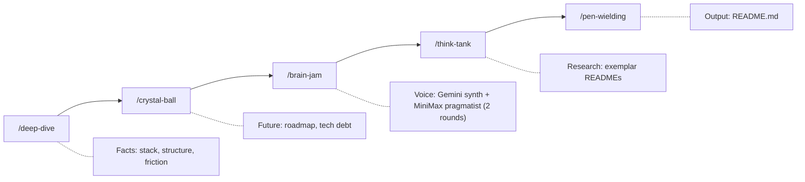

<p align="center">
  
</p>

<p align="center">
  <a href="LICENSE"></a>
  <a href="https://github.com/anthropics/claude-code"></a>
  
  
  
</p>

# Github Readme for Perfectionists

ESLint for prose. A Claude Code plugin that treats "delve" as a syntax error and will not let you skip to the final draft until five staged artifacts exist.

## Proof this works (or does not)

This README was written by running the plugin's own pipeline on this repository on 2026-07-22. The five stages produced: deep-dive (Reality Report, file-heuristic fallback), crystal-ball (roadmap candidates across performance, debt, features, security), brain-jam (Set List only: Chorus resolved but `GEMINI_API_KEY` / `MINIMAX_API_KEY` were unset, so the critic did not run), think-tank (6 exemplars scored), pen-wielding (this file).

Staging lives under `.claude/grfp/`. Brain-jam recorded `CAST=NO_KEYS` and continued with Critique unavailable. That is the documented non-terminating path when Stage 4 cannot call a provider.

Banned-word quota in the source above: Delve Index A0 B0 C0 D0 (pass).

## Before and after

The kind of sentence this plugin exists to delete:

> ~~It's important to note that this library provides a seamless way to delve into documentation generation, unleashing the full potential of your README workflow while harnessing a multifaceted, pivotal approach that plays a crucial role in shaping outcomes.~~

The kind of sentence this plugin ships:

> This plugin generates README files. It grades filler into Tier A–D budgets (hard ban / 0–1 / a couple / texture cap), enforces three sentence patterns that require specifics, and runs a third voice that flags weak claims the writer cannot see.

## Quick Start (the honest list)

```bash
# 1. Add the Claudikins marketplace
/marketplace add aMilkStack/claudikins-marketplace

# 2. Install this plugin
/plugin install claudikins-grfp

# 3. Install Chorus (brainstorm engine)
ln -sf /path/to/chorus ~/.claude/skills/chorus   # skills-directory plugin symlink
export GEMINI_API_KEY=your-gemini-key-here   # synth (preferred)
export MINIMAX_API_KEY=your-minimax-key-here # pragmatist + critic (preferred)
# Either key alone works - brain-jam falls back to a single-provider cast

# 4. Install Deno (Chorus runtime)
curl -fsSL https://deno.land/install.sh | sh

# 5. Run the pipeline
/claudikins-github-readme-for-perfectionists:grfp
```

Step 3 is the easy-to-miss one. The `brain-jam` stage shells out to the Chorus CLI via Deno. Stage 4 needs the Chorus symlink, Deno, and **at least one** of `GEMINI_API_KEY` or `MINIMAX_API_KEY`. Both keys give a cross-provider cast (Gemini 3.5 Flash synth + MiniMax-M3 pragmatist/critic); a single key falls back to that provider for all voices. Deno is required - Chorus does not ship a standalone binary. Without keys, Stage 4 writes Critique unavailable and later stages still run.

Optional: install `claudikins-tool-executor` or enable `codebase-memory` MCP for graph-analysis tools (`search_graph`, `trace_path`, `get_architecture`) that improve `/deep-dive` and `/crystal-ball` on real codebases. Without either, those stages fall back to file-based heuristics.

No Exa API key or search plugin is required. `/think-tank` uses built-in `WebSearch` and `WebFetch` by default.

## The pipeline

Five sequential stages. Each writes a staging file under `.claude/grfp/`. Later stages read earlier ones. The orchestrator refuses to skip ahead.

| # | Stage | Command suffix | Output artifact | Exit criterion |
| - | ----- | -------------- | --------------- | -------------- |
| 1 | Deep Dive | `:deep-dive` | `.claude/grfp/deep-dive.md` | Reality Report with stack, friction, entry points |
| 2 | Crystal Ball | `:crystal-ball` | `.claude/grfp/crystal-ball.md` | Roadmap Candidates tables |
| 3 | Brain Jam | `:brain-jam` | `.claude/grfp/brain-jam.md` | Three angles + critic blocks (when available) |
| 4 | Think Tank | `:think-tank` | `.claude/grfp/think-tank.md` | Exemplar scores + structural blueprint |
| 5 | Pen Wielding | `:pen-wielding` | `README.md` | Final prose passes Anti-Slop governance |

You are done when stage 5 writes the file, not when you feel ready.

## How it works



## The critic third voice (v3.1.0)

Stage 3 runs a 3-voice dialogue: a Gemini 3.5 Flash synth and a MiniMax-M3 pragmatist debate the angle, then an argdown-grounded critic emits structured anti-steelman, undefended assumptions, and an argument map after each round. Two dialogue rounds by default. The critic's output reshapes the next round's speaker prompts. The synthesis surfaces ideas neither voice had alone.

Argdown is plain-text argument notation. `[Claim]:` states a thesis. `+` adds support. `-` raises an attack. The critic uses it the same way a linter reads an AST.

Example of what `brain-jam.md` looks like when the critic succeeds:

````markdown
## Watch-Outs (anti-steelman per voice)

**Where the "synth" voice was weakest:**
- Round 1: "Assumes cold readers care about stage counts."

## Undefended Assumptions

- (pragmatist) "Warm traffic dominates; cold readers are the minority."
- (synth) "Exit criteria are visible from the README alone."

## Argument Map (round 2)

```argdown
[Hook]: The README is the proof of the tool
  + Recursion claim with dated artifacts
  - Bloat risk if every stage dumps jargon
```

**Surviving arguments (IN):** Hook, Recursion
**Defeated arguments (OUT):** Bloat
````

When the critic fails (missing API keys, model timeout, JSON truncation, argdown parse error), the adapter renders Block 1 (Set List) only or PARTIAL blocks from surviving rounds and footnotes which rounds failed. The dialogue is never aborted for critic loss alone. This dogfood run hit `NO_KEYS` before any round started; Set List still shaped the draft.

## What pen-wielding enforces

The writing stage applies four governance files plus a pre-write critique check:

- **style-guide.md** - graded Anti-Slop lexicon (Tier A–D budgets), three sentence patterns (Hook / Hammer / Trust Builder), humanisation rules, spelling consistency
- **structural-templates.md** - section ordering by project type, results tables, do/don't patterns
- **visual-engineering.md** - mermaid diagrams, ASCII progress bars, visual density floor of 1 per 300 words
- **anti-patterns.md** - writing anti-patterns (passive voice, hedging, generic headers), research anti-patterns, quality checklist
- **Step 3.5 (v3.1.0)** - scan `brain-jam.md`'s Watch-Outs, Undefended Assumptions, and Argument Map before writing. Be aware as you write. Substantiate the assumptions from `deep-dive.md` or cut the claim.

<details>
<summary><strong>The three sentence patterns</strong></summary>

You must vary between these three. Mixing them is the whole job.

### Pattern A: The Hook (Pain plus Solution)

**Use in:** Description, Intro.

| Before | After |
| --- | --- |
| "This library helps with JSON parsing issues." | "JSON logs are unreadable. Kinesis parses them instantly." |

### Pattern B: The Hammer (Fact plus Metric)

**Use in:** Features, Performance.

| Before | After |
| --- | --- |
| "The system is designed to be incredibly fast." | "Builds finish in under 200ms." |

### Pattern C: The Trust Builder (Constraint plus Fallback)

**Use in:** Usage, Technical sections.

| Before | After |
| --- | --- |
| "Works perfectly on all platforms." | "Uses `epoll` on Linux; falls back to `kqueue` on macOS." |

</details>

<details>
<summary><strong>Humanisation patterns</strong></summary>

Write TO readers, not AT them.

| Weak | Strong | Why |
| --- | --- | --- |
| "Users can optionally configure..." | "Configure your preferences in..." | Direct address over passive |
| "The system enables..." | "This helps you..." | Human over system |
| "Consider implementing..." | "Implement..." | Commands over suggestions |
| "We achieved 2.4M reach" | "We reached 2.4M people, 20% above target" | Context makes numbers meaningful |

</details>

## The graded lexicon

Flat zero-tolerance lists scrub texture until prose sounds machine-cleaned. Hits are counted in shipping prose only (not this table, not strikethrough demos, not the Delve Index badge).

| Tier | Budget | Rule |
| --- | --- | --- |
| **A** | **0** | Hard fail. Rewrite. |
| **B** | **0–1** | Prefer zero; a second hit fails. |
| **C** | **≤3** | A couple is fine; a fourth fails. |
| **D** | **≤5** | Texture cap; cut ceremony first. |

### Tier A — hard ban (0)

| Word | Replacement |
| --- | --- |
| Delve | Analyse, Check, Query |
| Tapestry | System, Network, Stack |
| Seamless | Compatible, Integrated |
| Unleash | Run, Execute, Enable |
| Elevate | Improve (with a metric) |
| Landscape | Delete the sentence |
| Testament | Proof, Example |
| Spearhead | Lead, Direct |
| Game-changer | Solves [specific problem] |
| Cutting-edge | Modern, Current |
| Empower | Allow, Enable, Let |
| It's important to note / It's worth noting | Delete; write the claim |
| Plays a crucial role | Does X / Causes Y / Controls Z |
| In today's … world/age | Delete the sentence |
| Embark / embark on a journey | Start, Begin, Run |

### Tier B — prefer zero (0–1)

| Word | Replacement |
| --- | --- |
| Foster | Encourage, Allow |
| Robust | Fault-tolerant, Atomic |
| Navigating / navigate the complexities | Using, Working with |
| Leverage | Use, Apply, Employ |
| Harness | Use, Apply, Run |
| Showcase | Show, Demonstrate, List |
| Realm | Area, Domain, Topic |
| Utilize | Use |
| Unlock | Enable, Open, Expose |
| Holistic | End-to-end, Whole-system, Across X |
| Pivotal | Key, Central, Required |
| Multifaceted | Complex, Varied, Has N parts |
| Underscore | Show, Prove, Make clear |
| Load-bearing | Critical, Essential, Required, Core |
| Reality check | Verify, Confirm, Check against [facts] |
| Spine | Core, Backbone, Main path, Structure |
| Substrate | Base layer, Foundation, Underlying layer |

### Tier C — a couple OK (≤3)

| Word | Replacement |
| --- | --- |
| Comprehensive | Full, Complete, Covers X/Y/Z |
| Nuanced | Specific, Precise, Distinguish X from Y |
| Intricate / intricacies | Complex, Detailed, Nested |
| Meticulous | Careful, Exact, Precise |
| Bolster | Strengthen, Support, Improve |
| Myriad | Many, Several, N |
| Crucial (standalone) | Required, Blocking, Determines X |
| Streamline | Simplify, Cut steps, Automate |
| Innovative / groundbreaking / transformative | New, First to…, Changes X by Y |
| Notably / Importantly (openers) | Delete opener; start with the claim |
| Dive deep / dive deeper | Inspect, Trace, Read |

### Tier D — texture budget (≤5)

| Word | Replacement |
| --- | --- |
| Moreover / Furthermore / Additionally (sentence-initial) | Also, And, or start next sentence |
| Ultimately / In conclusion / In summary | State the claim; end |
| When it comes to | Name the subject |
| At the end of the day | Delete |
| That being said | But, Still |
| Ensuring / ensures (padding) | Concrete verb for the action |
| Highlights (padding verb) | Show, List, Point out |
| Synergy / paradigm | Name the concrete interaction |
| Actionable / best practices | Specific next step |
| Double-edged sword | Name both sides |
| Vibrant / dynamic / bustling | Concrete detail or metric |
| Boast (meaning "has") | Has, Includes |

Over budget on any tier fails the README. Report `Delve Index: A# B# C# D# (pass|fail)`.

## State of the project (v3.1.0)

| Status | Item |
| --- | --- |
| Shipped | 5-stage pipeline with hard gates between stages |
| Shipped | Chorus brain-jam engine (replaced m2-brainstorm in v3.0.0) |
| Shipped | Gemini 3.5 Flash synth + MiniMax-M3 pragmatist/critic (v3.1.0) |
| Shipped | Single-provider fallbacks when only one API key is set |
| Shipped | 2-round dialogue synthesis (`--max-rounds 2`) |
| Shipped | Graded Anti-Slop lexicon (Tier A–D budgets; this branch) |
| Draft | Cast recipe at `skills/brain-jam/recipes/grfp-readme.json` |
| Missing | CI workflows (no `.github/workflows/`) |
| Missing | Offline / no-key brain-jam path beyond Critique unavailable |

## Quality targets

| Metric | Target |
| --- | --- |
| Flesch-Kincaid | Grade 8-10 |
| Time to Joy | 5 commands (honest count, see Quick Start) |
| Visual density | 1 per 300 words |
| Badge count | 5-7 |
| Delve Index | A0; B≤1; C≤3; D≤5 |

## When NOT to use this

- **You want full creative control.** The pipeline enforces structure. It will fight you.
- **Your project is trivial.** A 20-line script does not need a 5-phase pipeline.
- **You need speed.** Each phase takes minutes. The brain-jam stage alone is 3-9 minutes wallclock with critique on.
- **You hate opinionated tools.** The opinions are baked in.
- **You want a general-purpose AI conversation.** Ask Claude or GPT directly. The plugin's value is exit criteria, not chat fluency.

## Requirements

- Claude Code 1.0 or later
- Chorus plugin symlinked at `~/.claude/skills/chorus` (required for `/brain-jam`)
- Deno (required - Chorus launcher shells out to `deno run`)
- At least one of `GEMINI_API_KEY` or `MINIMAX_API_KEY` in environment or `~/.claude/skills/chorus/.env` (both preferred)
- `claudikins-tool-executor` plugin or `codebase-memory` MCP (optional; enables graph-analysis tools for `/deep-dive` and `/crystal-ball`)

## License

[MIT](LICENSE)

---

_Delve Index of this README: A0 B0 C0 D0 (pass). Pipeline run: 2026-07-22. Stages: deep-dive (file-heuristic), crystal-ball (content-level), brain-jam (NO_KEYS / Critique unavailable), think-tank (WebSearch), pen-wielding (graded lexicon A–D)._
