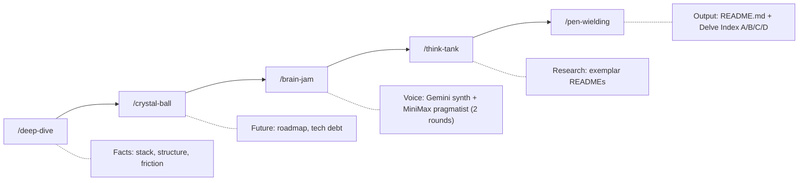

<p align="center">
  
</p>

<p align="center">
  <a href="LICENSE"></a>
  <a href="https://github.com/anthropics/claude-code"></a>
  
  
  
</p>

# Github Readme for Perfectionists

Blank-page READMEs stall. AI READMEs smell. This Claude Code plugin hard-gates five research stages, then grades filler on Tier A-D budgets so the draft stays specific without sounding machine-scrubbed.

## Proof this works (or does not)

This file is the output of `/pen-wielding` on 2026-07-22 (pass after the graded-lexicon cut). Staging from the same-day GRFP run: `Deep Dive` (file-heuristic), crystal-ball (content-level roadmap), brain-jam (`CAST=NO_KEYS` → Critique unavailable), think-tank (6 exemplars).

Artifacts live under `.claude/grfp/`. Without Gemini/MiniMax credentials, Stage 4 still wrote a Set List and later stages continued.

Delve Index for shipping prose: **A0 B0 C0 D0 (pass)**.

## Before and after

**Tier pile (delete):**

> ~~In today's digital age, it's important to note that this library provides a seamless way to delve into documentation, unleashing potential while harnessing a multifaceted, pivotal approach that plays a crucial role - and furthermore, ultimately, when it comes to READMEs, the synergy is actionable.~~

| Strike fragment | Tier |
| --- | --- |
| In today's digital age / it's important to note / delve / seamless / unleashing / plays a crucial role | **A** (0) |
| harnessing / multifaceted / pivotal | **B** (0-1) |
| furthermore / ultimately / when it comes to | **C** (≤3) |
| synergy / actionable | **D** (≤8) |

Those hits sit in marked mockery, so they do not spend budgets. The next sentence does.

**What ships:**

> This plugin writes READMEs. Tier A is a hard ban. Tier B allows one slip. Tier C allows a couple. Tier D caps soft adjectives and leftover ceremony at eight. Full token lists stay in the style guide, not here. Three sentence patterns force specifics. A third voice (when credentials exist) attacks weak claims before you ship.

## The graded lexicon

| Tier | Budget | Fail when |
| --- | --- | --- |
| **A** | **0** | Any hit |
| **B** | **0-1** | Count > 1 |
| **C** | **≤3** | Count > 3 |
| **D** | **≤8** | Count > 8 (soft warn > 5) |

**Exempt:** marked mockery (`~~…~~` or a `delete` / `anti-example` / `ai slop` cue), proper nouns and real identifiers (`API_KEY`, the `Deep Dive` stage title), Delve Index chrome, and the canonical lexicon tables.

Famous Tier A tells: delve, tapestry, seamless, unleash, "it's important to note", "plays a crucial role", "whether you're a…", "as an AI".

Canonical lists, replacements, exemptions, and ripgrep recipes: [`skills/pen-wielding/references/style-guide.md`](skills/pen-wielding/references/style-guide.md). Report as `Delve Index: A# B# C# D# (pass|fail)`.

## Quick Start (the honest list)

```bash
# 1. Add the Claudikins marketplace
/marketplace add aMilkStack/claudikins-marketplace

# 2. Install this plugin
/plugin install claudikins-grfp

# 3. Install Chorus (brainstorm engine)
ln -sf /path/to/chorus ~/.claude/skills/chorus   # skills-directory plugin symlink
export GEMINI_API_KEY=your-gemini-key-here   # synth (preferred)
export MINIMAX_API_KEY=your-minimax-key-here # pragmatist + critic (preferred)
# Either variable alone works - brain-jam falls back to a single-provider cast

# 4. Install Deno (Chorus runtime)
curl -fsSL https://deno.land/install.sh | sh

# 5. Run the pipeline
/claudikins-github-readme-for-perfectionists:grfp
```

Step 3 is the easy-to-miss one. The `brain-jam` stage shells out to the Chorus CLI via Deno. Stage 4 needs the Chorus symlink, Deno, and **at least one** of `GEMINI_API_KEY` or `MINIMAX_API_KEY`. Both give a cross-provider cast (Gemini 3.5 Flash synth + MiniMax-M3 pragmatist/critic); a single provider covers all voices. Deno is required - Chorus does not ship a standalone binary. Without credentials, Stage 4 writes Critique unavailable and later stages still run.

Optional: install `claudikins-tool-executor` or enable `codebase-memory` MCP for graph tools (`search_graph`, `trace_path`, `get_architecture`) that improve `/deep-dive` and `/crystal-ball` on real codebases. Without either, those stages fall back to file-based heuristics.

No Exa credential or search plugin is required. `/think-tank` uses built-in `WebSearch` and `WebFetch` by default.

## The pipeline

Five sequential stages. Each writes a staging file under `.claude/grfp/`. Later stages read earlier ones. The orchestrator refuses to skip ahead.

| # | Stage | Command suffix | Output artifact | Exit criterion |
| - | ----- | -------------- | --------------- | -------------- |
| 1 | Deep Dive | `:deep-dive` | `.claude/grfp/deep-dive.md` | Reality Report with stack, friction, entry points |
| 2 | Crystal Ball | `:crystal-ball` | `.claude/grfp/crystal-ball.md` | Roadmap Candidates tables |
| 3 | Brain Jam | `:brain-jam` | `.claude/grfp/brain-jam.md` | Three angles + critic blocks (when available) |
| 4 | Think Tank | `:think-tank` | `.claude/grfp/think-tank.md` | Exemplar scores + structural blueprint |
| 5 | Pen Wielding | `:pen-wielding` | `README.md` | Graded lexicon quotas + sentence patterns pass |

You are done when stage 5 writes the file, not when you feel ready.

## How it works



## The critic third voice (v3.1.0)

Stage 3 runs a 3-voice dialogue: a Gemini 3.5 Flash synth and a MiniMax-M3 pragmatist debate the angle, then an argdown-grounded critic emits structured anti-steelman, undefended assumptions, and an argument map after each round. Two dialogue rounds by default. The critic's output reshapes the next round's speaker prompts.

Argdown is plain-text argument notation. `[Claim]:` states a thesis. `+` adds support. `-` raises an attack. The critic reads it the way a linter reads an AST.

Example when the critic succeeds:

````markdown
## Watch-Outs (anti-steelman per voice)

**Where the "synth" voice was weakest:**
- Round 1: "Assumes cold readers care about stage counts."

## Undefended Assumptions

- (pragmatist) "Warm traffic dominates; cold readers are the minority."
- (synth) "Exit criteria are visible from the README alone."

## Argument Map (round 2)

```argdown
[Hook]: The README is the proof of the tool
  + Recursion claim with dated artifacts
  - Bloat risk if every stage dumps jargon
```

**Surviving arguments (IN):** Hook, Recursion
**Defeated arguments (OUT):** Bloat
````

When the critic fails (missing credentials, model timeout, JSON truncation, argdown parse error), the adapter renders Block 1 (Set List) only or PARTIAL blocks from surviving rounds and footnotes the gaps. Critic loss alone does not abort the dialogue. This dogfood run hit `NO_KEYS` before any round started; Set List still shaped the draft.

## What pen-wielding enforces

Four governance files plus a pre-write critique check:

- **style-guide.md** - graded lexicon (A0 / B≤1 / C≤3 / D≤8), Hook / Hammer / Trust Builder patterns, humanisation rules, spelling consistency
- **structural-templates.md** - section order by project type, results tables, do/don't patterns
- **visual-engineering.md** - mermaid, ASCII progress bars, visual density floor of 1 per 300 words
- **anti-patterns.md** - passive voice, hedging, generic headers, research anti-patterns, quality checklist
- **Step 3.5 (v3.1.0)** - scan `brain-jam.md` Watch-Outs, Undefended Assumptions, and Argument Map before writing. Substantiate assumptions from `deep-dive.md` or cut the claim.

<details>
<summary><strong>The three sentence patterns</strong></summary>

Vary between these three. Mixing them is the job.

### Pattern A: The Hook (Pain plus Solution)

**Use in:** Description, Intro.

| Before | After |
| --- | --- |
| "This library helps with JSON parsing issues." | "JSON logs are unreadable. Kinesis parses them instantly." |

### Pattern B: The Hammer (Fact plus Metric)

**Use in:** Features, Performance.

| Before | After |
| --- | --- |
| "The system is designed to be incredibly fast." | "Builds finish in under 200ms." |

### Pattern C: The Trust Builder (Constraint plus Fallback)

**Use in:** Usage, Technical sections.

| Before | After |
| --- | --- |
| "Works perfectly on all platforms." | "Uses `epoll` on Linux; falls back to `kqueue` on macOS." |

</details>

<details>
<summary><strong>Humanisation patterns</strong></summary>

Write TO readers, not AT them.

| Weak | Strong | Why |
| --- | --- | --- |
| "Users can optionally configure..." | "Configure your preferences in..." | Direct address over passive |
| "The system enables..." | "This helps you..." | Human over system |
| "Consider implementing..." | "Implement..." | Commands over suggestions |
| "We achieved 2.4M reach" | "We reached 2.4M people, 20% above target" | Context makes numbers meaningful |

</details>

## State of the project (v3.1.0)

| Status | Item |
| --- | --- |
| Shipped | 5-stage pipeline with hard gates between stages |
| Shipped | Chorus brain-jam engine (replaced m2-brainstorm in v3.0.0) |
| Shipped | Gemini 3.5 Flash synth + MiniMax-M3 pragmatist/critic (v3.1.0) |
| Shipped | Single-provider fallbacks when only one provider credential is set |
| Shipped | 2-round dialogue synthesis (`--max-rounds 2`) |
| Shipped | Graded Anti-Slop lexicon (Tier A-D) with mockery + proper-noun exemptions |
| Draft | Cast recipe at `skills/brain-jam/recipes/grfp-readme.json` |
| Missing | CI that enforces Delve Index quotas |
| Missing | Offline brain-jam path beyond Critique unavailable |

## Quality targets

| Metric | Target |
| --- | --- |
| Flesch-Kincaid | Grade 8-10 |
| Time to Joy | 5 commands (honest count, see Quick Start) |
| Visual density | 1 per 300 words |
| Badge count | 5-7 |
| Delve Index | A0; B≤1; C≤3; D≤8 |

## When NOT to use this

- **You want full creative control.** The pipeline enforces structure. It will fight you.
- **Your project is trivial.** A 20-line script does not need a 5-phase pipeline.
- **You need speed.** Each phase takes minutes. Brain-jam alone is often 3-9 minutes wallclock with critique on.
- **You hate opinionated tools.** The opinions are baked in.
- **You want a general-purpose AI conversation.** Ask the model directly. This plugin sells exit criteria, not chat fluency.

## Requirements

- Claude Code 1.0 or later
- Chorus plugin symlinked at `~/.claude/skills/chorus` (required for `/brain-jam`)
- Deno (required - Chorus launcher shells out to `deno run`)
- At least one of `GEMINI_API_KEY` or `MINIMAX_API_KEY` in the environment or `~/.claude/skills/chorus/.env` (both preferred)
- `claudikins-tool-executor` plugin or `codebase-memory` MCP (optional; graph tools for `/deep-dive` and `/crystal-ball`)

## License

[MIT](LICENSE)

---

_Delve Index: A0 B0 C0 D0 (pass). Pen-wielding pass: 2026-07-22 (slim graded lexicon + exemptions). Prior stages: Deep Dive (file-heuristic), crystal-ball (content-level), brain-jam (NO_KEYS), think-tank (WebSearch)._
