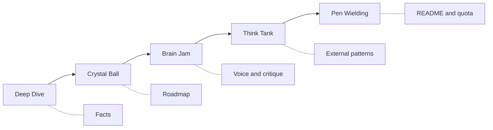

<p align="center">
  
</p>

<p align="center">
  <a href="LICENSE"></a>
  <a href="https://github.com/anthropics/claude-code"></a>
  
  
  
</p>

# Claudikins GRFP - A README gate and prose linter for Claude Code

AI copy gets spotted. GRFP makes Claude earn the final draft through five staged files, a multi-model critique, and graded language budgets.

## Proof from the 2026-07-23 run

This README is not proof because it says so. The pass criterion is explicit: Tier A must be 0, Tier B may reach 1, Tier C may reach 3, and Tier D may reach 8 after documented exclusions.

| Check | Result | Evidence |
| --- | --- | --- |
| Repository scan | 58 tracked files, 48 Markdown files, 6 skills, 6 commands | `.claude/grfp/deep-dive.md` |
| Graph check | 0 source files indexed; file-and-content fallback used | `.claude/grfp/graph-status.json` |
| Roadmap audit | Stage-order drift and regex drift recorded | `.claude/grfp/crystal-ball.md` |
| Brain Jam | Gemini 3.5 Flash + MiniMax-M3, 2 critic rounds returned `ok` | `.claude/grfp/brainstorm-transcript-20260723T092738.json` |
| Exemplar scan | 7 live GitHub READMEs scored | `.claude/grfp/think-tank.md` |
| Final quota | **A0 B0 C0 D0 (pass)** | Audit run after this file was written |

The run used the installed Chorus 0.2.0 cache launcher because the documented symlink was absent. That gap is visible here instead of being rewritten as a success story.

## See the rule change work

**AI slop sample (delete):**

> ~~It's important to note that this grounded evidence gives the README a seamless spine, ultimately transforming documentation.~~

| Marked token | Tier | Rule |
| --- | --- | --- |
| `spine` | **A** | Zero allowed |
| `grounded` | **C** | `ground*` stem match |
| `seamless` / `it's important to note` | **A** | Zero allowed |
| `ultimately` | **C** | Three total allowed |

Those hits are excluded because the quote is marked as an anti-example and the table only labels that quote.

**What ships:**

> The plugin writes a README after five artifacts exist. Its audit reports A-D counts against fixed budgets.

## Quick Start: the honest five steps

```bash
# 1. Add the Claudikins marketplace
/marketplace add aMilkStack/claudikins-marketplace

# 2. Install this plugin
/plugin install claudikins-grfp

# 3. Install Chorus and expose its launcher
ln -sf /path/to/chorus ~/.claude/skills/chorus

# 4. Install Deno
curl -fsSL https://deno.land/install.sh | sh

# 5. Run the pipeline
/claudikins-github-readme-for-perfectionists:grfp
```

Brain Jam needs at least one provider credential. Put `GEMINI_API_KEY` or `MINIMAX_API_KEY` in the environment or in the Chorus `.env` file; both variables select the cross-provider cast. Do not commit real credentials.

The setup takes five steps because Chorus and Deno live outside this repository. GRFP does not hide that cost behind an install claim it cannot meet.

## Five artifacts before the final draft

| # | Stage | Command suffix | Output | Gate |
| ---: | --- | --- | --- | --- |
| 1 | Deep Dive | `:deep-dive` | `.claude/grfp/deep-dive.md` | Facts, entry points, install friction |
| 2 | Crystal Ball | `:crystal-ball` | `.claude/grfp/crystal-ball.md` | Roadmap candidates and debt |
| 3 | Brain Jam | `:brain-jam` | `.claude/grfp/brain-jam.md` | Three angles plus critic output |
| 4 | Think Tank | `:think-tank` | `.claude/grfp/think-tank.md` | Exemplar scores and structure plan |
| 5 | Pen Wielding | `:pen-wielding` | `README.md` | Final prose and A-D quota result |



The orchestrator checks for each artifact before it advances. Independent command files currently disagree on the middle-stage labels and handoffs; `skills/grfp/SKILL.md` is the order used above, and command alignment remains open debt.

## Graded prose rules

A flat ban makes prose sound scrubbed. GRFP uses four budgets and counts shipping prose only.

| Tier | Budget | Failure point |
| --- | ---: | --- |
| **A** | **0** | First hit |
| **B** | **0-1** | Second hit |
| **C** | **0-3** | Fourth hit |
| **D** | **0-8** | Ninth hit |

Marked mockery, canonical lexicon tables, real proper nouns, identifiers, stage titles, and Delve Index labels do not spend the budget. Ordinary prose, headings, feature bullets, and unlabeled quotes do.

The canonical tokens, phrase rules, replacements, exclusions, and audit examples live in [`skills/pen-wielding/references/style-guide.md`](skills/pen-wielding/references/style-guide.md). The tables are authoritative where an older regex example differs.

## What the critic contributes

Brain Jam runs a two-round dialogue. Gemini 3.5 Flash takes the synth role; MiniMax-M3 takes the pragmatist and critic roles when both provider credentials exist.

Each critic round returns:

- an anti-steelman for each speaker;
- premises that no speaker defended;
- an Argdown map;
- extension labels when the argument solver produces them.

The 2026-07-23 run returned `ok` for both critic rounds. Its final warning changed the README angle: a recursive claim proves nothing unless the file names its threshold and result.

### Failure behavior

| Outcome | README staging behavior |
| --- | --- |
| Both critic rounds return `ok` | Render Set List, Watch-Outs, assumptions, and final argument map |
| Some critic rounds fail | Render surviving critique and name missing rounds |
| All critic rounds fail | Keep the Set List and write `Critique unavailable` |
| Chorus exits non-zero | Surface stderr and stop Brain Jam |

Critic loss does not erase successful speaker turns. A launcher or provider failure still stops the stage rather than inventing a transcript.

## What GRFP does and does not do

| GRFP does | GRFP does not |
| --- | --- |
| Require staged research before drafting | Inspect tokens during model streaming |
| Apply documented budgets to completed prose | Claim a formal compiler grammar or AST |
| Store run artifacts under `.claude/grfp/` | Promise provider uptime |
| Record critique gaps in the generated artifact | Invent testimonials or adoption numbers |
| Fall back to file analysis when no source graph exists | Turn command drift into a fake runtime feature |

Timestamped transcripts can contain repository facts, prompts, and model responses. Review them before committing, or keep them outside version control when the source material is private.

## Current state and next fixes

| Status | Item |
| --- | --- |
| Shipped | Five-stage artifact gate |
| Shipped | Tier A-D budgets with mockery and proper-noun exclusions |
| Shipped | Gemini/MiniMax cast selection and single-provider recipes |
| Shipped | Full, partial, and unavailable critic rendering |
| Open debt | Align stage numbers and handoffs across command files |
| Open debt | Reconcile every audit regex with the canonical tier tables |
| Open debt | Add a preflight for Chorus, Deno, and provider credentials |
| Open debt | Add CI checks for JSON recipes, stage order, and quota fixtures |
| Open debt | Document transcript retention and Windows setup |

See [open issues](https://github.com/kellenff/claudikins-github-readme-for-perfectionists/issues) for support or proposals.

## When to skip GRFP

- A short script does not need five research artifacts.
- A writer who wants unrestricted prose will fight the gate on every pass.
- A team that cannot send prompts to external providers cannot run the current Brain Jam cast.
- A deadline measured in seconds is a poor fit for a multi-stage research workflow.

## Requirements

- Claude Code 1.0 or later
- Chorus with an executable launcher
- Deno 2.x
- `GEMINI_API_KEY`, `MINIMAX_API_KEY`, or both
- Optional graph tooling for repositories with source symbols

## License

[MIT](LICENSE)

---

_Delve Index: A0 B0 C0 D0 (pass). Pen Wielding run: 2026-07-23. Brain Jam: FULL, 2/2 critic rounds `ok`. Think Tank: 7 live GitHub READMEs._
