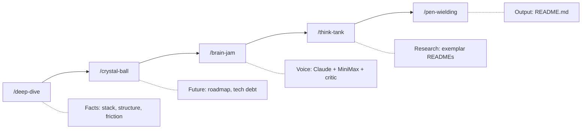

<p align="center">
  
</p>

<p align="center">
  <a href="LICENSE"></a>
  <a href="https://github.com/anthropics/claude-code"></a>
  
  
  
</p>

# Github Readme for Perfectionists

ESLint for prose. A Claude Code plugin that treats "delve" as a syntax error.

## Proof this works (or doesn't)

This README was written by running the plugin's own pipeline on this repository on 2026-05-27. The five stages produced: deep-dive (Reality Report, 132 lines), crystal-ball (9 roadmap candidates), brain-jam (3 angles via Claude + MiniMax dialogue), think-tank (4 exemplars scored against a rubric), pen-wielding (this file).

The critic third voice was unavailable for all 3 brain-jam rounds because the upstream MiniMax model truncated its JSON output inside the `anti_steelman` field. That failure was supposed to happen invisibly. The plugin's NO-CRITIQUE fallback rendered the brain-jam synthesis without the third voice, footnoted the error per round, and continued. You can read the full transcript at `.claude/grfp/brainstorm-transcript-20260527T174528.json` if you doubt the recursion.

Banned-word count in the source above: 0.

## Before and after

The kind of sentence this plugin exists to delete:

> ~~This library provides a seamless way to delve into documentation generation, unleashing the full potential of your README workflow.~~

The kind of sentence this plugin ships:

> This plugin generates README files. It bans 15 filler words, enforces three sentence patterns that require specifics, and renders a structured critique that flags weak claims the writer cannot see.

## Quick Start (the honest list)

```bash
# 1. Add the Claudikins marketplace
/marketplace add aMilkStack/claudikins-marketplace

# 2. Install this plugin
/plugin install claudikins-grfp

# 3. Enable the brainstorm engine
/plugin           # then toggle: m2-brainstorm@m2-deep-research

# 4. Install the m2-brainstorm binary (75M, one-time)
bash ~/.claude/plugins/cache/m2-deep-research/m2-brainstorm/0.3.0/install.sh

# 5. Run the pipeline
/claudikins-github-readme-for-perfectionists:grfp
```

Step 4 is the easy-to-miss one. The `brain-jam` stage shells out to a pre-compiled binary that the m2-brainstorm plugin downloads on first install. Without it, Stage 4 halts with `command not found`. The earlier "2 commands to install" claim in v2.0.0 was wrong, and the gap killed credibility for anyone who tried to run the pipeline before reading the changelog.

Optional: install `claudikins-tool-executor` for graph-analysis tools (`search_graph`, `trace_path`, `get_architecture`) that improve `/deep-dive` and `/crystal-ball` on real codebases. Without it, those stages fall back to file-based heuristics.

## How it works



Each stage writes a discrete artifact under `.claude/grfp/`. Later stages consume earlier ones. The orchestrator refuses to skip ahead: if `crystal-ball.md` is missing, `/brain-jam` halts. This is the forcing function the pipeline sells. You are done when stage 5 writes the file, not when you feel ready.

## The critic third voice (v2.1.0)

Stage 3 runs a 3-voice dialogue: a Claude-synth and a MiniMax-pragmatist debate the angle, then an argdown-grounded critic emits structured anti-steelman, undefended assumptions, and an argument graph after each round. The critic's output reshapes the next round's speaker prompts. The synthesis surfaces ideas neither voice had alone.

Example of what `brain-jam.md` looks like when the critic succeeds:

````markdown
## Watch-Outs (anti-steelman per voice)

**Where the "deep tech" voice was weakest:**
- Round 2: "The argdown grounding only matters if the reader already
  knows what a Dung extension is; otherwise it reads as jargon proof."

## Undefended Assumptions

- (pragmatist) "Warm traffic dominates; cold readers are the minority."
- (claude) "Exit criteria are visible from the README alone."

## Argument Map (round 3)

```argdown
[Hook]: The README is the proof of the tool
  +> [Recursion]: It was written by the pipeline
  -> [Bloat]: Five stages signals over-engineering
```

**Surviving arguments (IN):** Hook, Recursion
**Defeated arguments (OUT):** Bloat
````

When the critic fails (model timeout, JSON truncation, argdown parse error), the adapter renders Block 1 (Set List) only and footnotes which rounds failed. The dialogue is never aborted. That fallback fired three times in this README's brain-jam stage; the synthesis still landed.

## What pen-wielding enforces

The writing stage applies four governance files plus a pre-write critique check:

- **style-guide.md** - 15 banned words, three sentence patterns (Hook / Hammer / Trust Builder), humanisation rules, spelling consistency
- **structural-templates.md** - section ordering by project type, results tables, do/don't patterns
- **visual-engineering.md** - mermaid diagrams, ASCII progress bars, visual density floor of 1 per 300 words
- **anti-patterns.md** - writing anti-patterns (passive voice, hedging, generic headers), research anti-patterns, quality checklist
- **Step 3.5 (v2.1.0)** - scan `brain-jam.md`'s Watch-Outs, Undefended Assumptions, and Argument Map before writing. Be aware as you write. Substantiate the assumptions from `deep-dive.md` or cut the claim.

<details>
<summary><strong>The three sentence patterns</strong></summary>

You must vary between these three. Mixing them is the whole job.

### Pattern A: The Hook (Pain plus Solution)

**Use in:** Description, Intro.

| Before | After |
| --- | --- |
| "This library helps with JSON parsing issues." | "JSON logs are unreadable. Kinesis parses them instantly." |

### Pattern B: The Hammer (Fact plus Metric)

**Use in:** Features, Performance.

| Before | After |
| --- | --- |
| "The system is designed to be incredibly fast." | "Builds finish in under 200ms." |

### Pattern C: The Trust Builder (Constraint plus Fallback)

**Use in:** Usage, Technical sections.

| Before | After |
| --- | --- |
| "Works perfectly on all platforms." | "Uses `epoll` on Linux; falls back to `kqueue` on macOS." |

</details>

<details>
<summary><strong>Humanisation patterns</strong></summary>

Write TO readers, not AT them.

| Weak | Strong | Why |
| --- | --- | --- |
| "Users can optionally configure..." | "Configure your preferences in..." | Direct address over passive |
| "The system enables..." | "This helps you..." | Human over system |
| "Consider implementing..." | "Implement..." | Commands over suggestions |
| "We achieved 2.4M reach" | "We reached 2.4M people, 20% above target" | Context makes numbers meaningful |

</details>

## The banned words

| Word | Replacement |
| --- | --- |
| Delve | Analyse, Check, Query |
| Seamless | Compatible, Integrated |
| Unleash | Run, Execute, Enable |
| Robust | Fault-tolerant, Atomic |
| Tapestry | System, Network, Stack |
| Landscape | Delete the sentence |
| Elevate | Improve (with a metric) |
| Testament | Proof, Example |
| Foster | Encourage, Allow |
| Spearhead | Lead, Direct |
| Game-changer | Solves [specific problem] |
| Navigating | Using, Working with |
| Leverage | Use, Apply, Employ |
| Cutting-edge | Modern, Current |
| Empower | Allow, Enable, Let |

If any of these appear in the output, the README fails its own rules.

## Quality targets

| Metric | Target |
| --- | --- |
| Flesch-Kincaid | Grade 8-10 |
| Time to Joy | 4-5 commands (honest count, see Quick Start) |
| Visual density | 1 per 300 words |
| Badge count | 5-7 max |

## When NOT to use this

- **You want full creative control.** The pipeline enforces structure. It will fight you.
- **Your project is trivial.** A 20-line script does not need a 5-phase pipeline.
- **You need speed.** Each phase takes minutes. The brain-jam stage alone is 3-5 minutes wallclock with critique on.
- **You hate opinionated tools.** The opinions are baked in.
- **You want a general-purpose AI conversation.** Ask Claude or GPT directly. The plugin's value is exit criteria, not chat fluency.

## Requirements

- Claude Code 1.0 or later
- `m2-brainstorm@m2-deep-research` plugin (required for `/brain-jam`)
- `~/.config/m2-brainstorm/bin/m2-brainstorm` binary (75M, installed by the m2-brainstorm install script)
- `claudikins-tool-executor` plugin (optional; enables graph-analysis tools for `/deep-dive` and `/crystal-ball`)

The m2-brainstorm CLI requires both `MINIMAX_API_KEY` and `EXA_API_KEY` to start, even though `/brain-jam` only calls MiniMax. If you do not have an Exa key, `EXA_API_KEY=dummy` satisfies the validator without enabling research-mode calls. This is an upstream config-validation quirk being tracked at m2-deep-research; the workaround stays valid until the validator narrows.

## License

[MIT](LICENSE)

---

_Delve Index of this README: 0%. Pipeline run: 2026-05-27. Stages: deep-dive (2m), crystal-ball (1.5m), brain-jam (4m, critic unavailable per upstream JSON truncation), think-tank (3m), pen-wielding (5m)._
